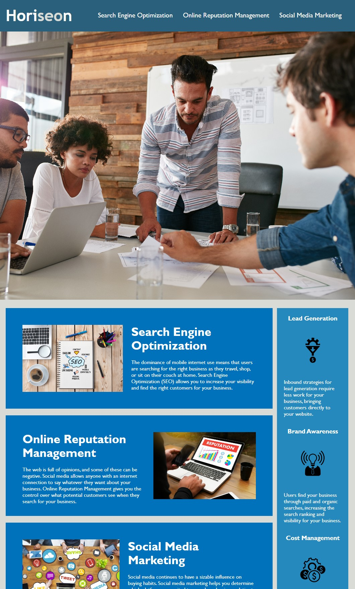

# horiseon-accessibility-refactor

## Description

The purpose of this refactor was to improve the accessability features of Horiseon's main webpage, and optimize it from an SEO standpoint. The webpage was not built in a way that would be friendly to screen readers, and the coding was formatted in a way that didn't make sense to the overall flow of the page.

This update swapped out non-semantic elements in favor of semantic ones, providing guidance to users interacting with the page via screen readers. It also added alt text to the images for screen readers, or in the event that the image files are not available for the page.

I also reconfigured the flow of the CSS coding to align to the general flow of the page. This will make it easier in the future to reconfigure the CSS file against the HTML.

## Usage

The webpage includes three links in the nav section of the header. These links travel down to the coresponding sections below the large top image.

